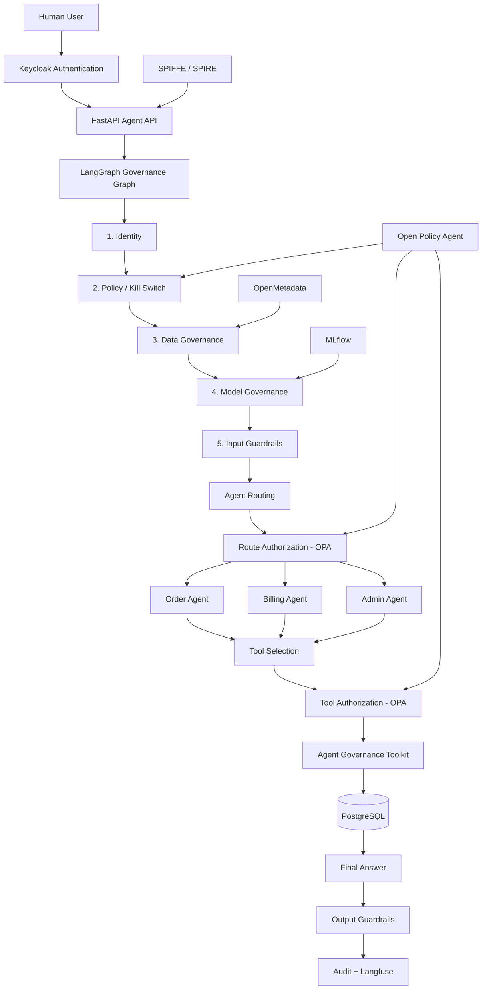
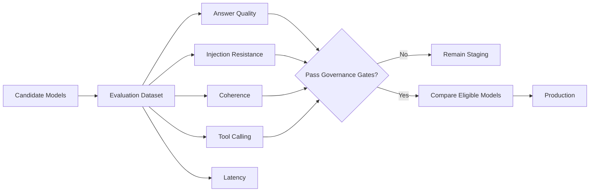
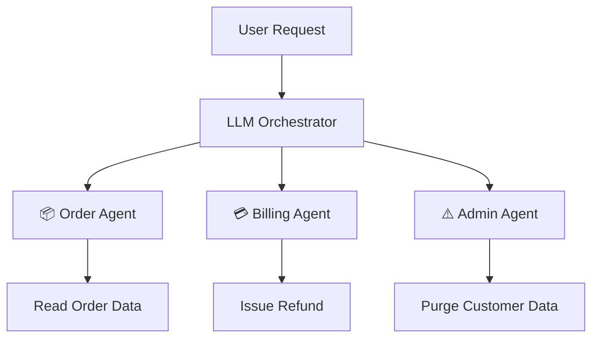

<div align="center">

# 🛡️ GovernAI

### *Policy-Enforced AI Governance Platform for Multi-Agent Systems*

[](https://www.python.org/)
[](https://fastapi.tiangolo.com/)
[](https://langchain-ai.github.io/langgraph/)
[](https://www.openpolicyagent.org/)
[](https://mlflow.org/)
[](https://www.postgresql.org/)
[](https://www.docker.com/)

<p align="center">
  <i>🔐 Identity • ⚖️ Policy • 🗄️ Data Governance • 🧠 Model Governance • 🛡️ Guardrails • 🔧 Tool Authorization • 📊 Auditability</i>
</p>

[Overview](#-what-is-governai) •
[Architecture](#️-architecture) •
[Governance](#-seven-layer-governance-pipeline) •
[Agents](#-multi-agent-system) •
[Model Governance](#-model-governance) •
[Security](#-identity--authorization) •
[Setup](#-local-setup)

<br>

```text
╔════════════════════════════════════════════════════════════════════════╗
║                                                                        ║
║   Human → Keycloak → LangGraph → Governance Pipeline → AI Agent       ║
║                          │                                             ║
║            Identity • Policy • Data • Model • Guardrails               ║
║                          │                                             ║
║              OPA → Tool Authorization → PostgreSQL                     ║
║                          │                                             ║
║               Audit Trail + Langfuse Tracing                           ║
║                                                                        ║
╚════════════════════════════════════════════════════════════════════════╝
```

</div>

---

## 🔎 What is GovernAI?

**GovernAI** is an end-to-end AI governance platform that demonstrates how a multi-agent AI system can be controlled before it is allowed to access data, invoke tools, or perform real actions.

Instead of placing governance around the application as documentation, GovernAI makes governance part of the **actual LangGraph execution path**.

Every request passes through controls for:

- 🔐 Human and workload identity
- ⚖️ Centralized policy enforcement
- 🗄️ Sensitive-data classification and masking
- 🧠 Model approval and risk-tier enforcement
- 🛡️ Prompt and output guardrails
- 🔧 Agent routing and tool authorization
- 📜 Tamper-evident decision auditing
- 📊 LLM tracing and observability

The system uses real services rather than mocked governance components.

```text
User Request
     ↓
Identity Verification
     ↓
Policy Enforcement
     ↓
Data Governance
     ↓
Model Governance
     ↓
Agent Guardrails
     ↓
Agent + Tool Authorization
     ↓
Action
     ↓
Audit + Observability
```

---

# ✨ Key Features

<table>
<tr>
<td width="50%">

### 🔐 Identity Governance

- Keycloak human authentication
- Signed JWT verification
- Role extraction from verified claims
- SPIFFE/SPIRE workload identity
- Short-lived workload credentials
- Emergency workload kill switch

</td>

<td width="50%">

### ⚖️ Policy Enforcement

- Open Policy Agent (OPA)
- Rego-based centralized policies
- Role-based agent routing
- Tool-level authorization
- Runtime permission overrides
- Default-deny authorization model

</td>
</tr>

<tr>
<td width="50%">

### 🧠 Model Governance

- MLflow Model Registry
- Candidate model registration
- Real LLM evaluation
- Automated promotion/demotion
- Risk-tier classification
- Risk-based access through OPA

</td>

<td width="50%">

### 🗄️ Data Governance

- OpenMetadata data catalog
- PostgreSQL schema discovery
- PII classification
- Policy-driven masking
- Data lineage
- Fail-closed classification handling

</td>
</tr>

<tr>
<td width="50%">

### 🤖 Governed Multi-Agent System

- LangGraph orchestration
- Order agent
- Billing agent
- Admin agent
- Agent handoff authorization
- Tool execution governance

</td>

<td width="50%">

### 📊 Auditability & Observability

- Langfuse LLM tracing
- OPA decision logging
- PostgreSQL audit storage
- SHA-256 hash-chained audit records
- Compliance evidence collection
- Streamlit governance dashboard

</td>
</tr>
</table>

---

# 🏗️ Architecture



---

# 🔄 End-to-End Workflow

## 1. Human authentication

The user logs in through **Keycloak**.

```text
User
 ↓
Keycloak
 ↓
Signed JWT
 ↓
FastAPI
```

The application verifies the JWT and extracts the user's trusted role.

Example roles:

```text
student
→ demo-agent

instructor
→ admin
```

The role is never trusted directly from the request body.

---

## 2. Workload identity

The AI application also has its own identity.

```text
AI Agent
   ↓
SPIRE
   ↓
Short-Lived SVID
   ↓
spiffe://governance.demo/agent/demo-agent
```

This separates:

```text
Human Identity
→ Keycloak

Workload Identity
→ SPIFFE/SPIRE
```

---

# 🛡️ Seven-Layer Governance Pipeline

Every request moves through the governance graph before an agent can perform an action.

```text
Identity
   ↓
Policy
   ↓
Data
   ↓
Model
   ↓
Agent Guardrails
   ↓
Tool Authorization
   ↓
Logged
```

Any governance node can stop execution immediately.

```text
Governance Check
       ↓
   Pass?
   /   \
 Yes    No
 ↓       ↓
Next    Logged
Layer   + Blocked
```

---

## 🔐 Layer 1 — Identity

Validates:

```text
Human JWT
+
SPIFFE workload identity
```

Keycloak proves **who the user is**.

SPIFFE/SPIRE proves **which AI workload is running**.

---

## ⚖️ Layer 2 — Policy

Open Policy Agent checks whether the AI workload has been revoked.

```text
SPIFFE Identity
      ↓
OPA
      ↓
Kill Switch
   /      \
ACTIVE   REVOKED
  ↓         ↓
Continue   BLOCK
```

The dashboard can revoke the workload identity to immediately stop the agent.

---

## 🗄️ Layer 3 — Data Governance

OpenMetadata catalogs the application's PostgreSQL schema.

For example:

```text
customers
├── customer_id
├── name
└── email
      ↓
PII.Sensitive
```

When sensitive information is returned:

```text
alice@example.com
        ↓
OpenMetadata classification
        ↓
OPA masking policy
        ↓
***MASKED***
```

Sensitive-data decisions are driven by metadata rather than hardcoded column names.

---

# 🧠 Model Governance

MLflow acts as the model registry and approval system.

Candidate models are registered as:

```text
governance-agent-model

├── Groq / Llama
│   └── Staging
│
└── OpenAI / GPT
    └── Staging
```

No candidate becomes Production simply because a configuration file says so.

The promotion pipeline runs real evaluations.



The evaluation checks:

```text
Answer correctness
Prompt-injection resistance
Coherence/readability
Tool-calling reliability
Latency
```

Models receive a governance risk tier:

```text
LOW
MEDIUM
HIGH
```

That risk tier is stored in MLflow.

---

## ⚖️ Risk-Based Model Access

Production status alone is not enough.

OPA performs another authorization decision:

```text
Production Model
      ↓
MLflow Risk Tier
      ↓
OPA
      ↓
Can this role use this risk level?
```

For example:

```text
demo-agent
→ low / medium

admin
→ low / medium / high
```

This makes model risk classification an operational control rather than only documentation.

---

# 🤖 Multi-Agent System

GovernAI uses LangGraph to route requests to specialized agents.



---

## 📦 Order Agent

Read-only operations such as:

```text
Search orders
Get order details
Check order status
```

---

## 💳 Billing Agent

Handles controlled write operations:

```text
Issue refund
Update order status
```

---

## ⚠️ Admin Agent

Handles destructive operations:

```text
Purge customer data
```

The admin agent is restricted to the `admin` role.

---

# 🔧 Agent & Tool Authorization

Governance occurs at **two levels**.

First:

```text
Can this role route to this agent?
```

Then:

```text
Can this role execute this specific tool?
```

Example:

```text
User Request
     ↓
Router chooses admin_agent
     ↓
OPA checks route:admin_agent
     ↓
demo-agent
     ↓
DENY ❌
```

The specialist agent is never reached.

Even after successful routing:

```text
Agent chooses tool
     ↓
OPA tool authorization
     ↓
Agent Governance Toolkit
     ↓
Real tool execution
```

---

# 🛡️ Guardrails

Input and output are both checked.

### Input

```text
User Prompt
    ↓
Prompt Injection Detection
    ↓
Safe?
```

### Output

```text
LLM Response
    ↓
Output Validation
    ↓
Sensitive information detected?
        /       \
      No         Yes
      ↓           ↓
   Return      Withhold
              Response
```

Unsafe output is marked as blocked:

```text
blocked = true
blocked_at = agent_guardrails
```

---

# 🔐 Kill Switch

GovernAI includes an emergency workload kill switch.

```text
Administrator
      ↓
Revoke Agent
      ↓
OPA
      ↓
SPIFFE Identity Revoked
      ↓
ALL Agent Requests Blocked
```

This differs from revoking one tool:

```text
Tool Revoke
→ disable one capability

Kill Switch
→ disable the entire AI workload
```

---

# 📜 Tamper-Evident Audit Trail

OPA governance decisions are written to PostgreSQL.

Each audit record stores:

```text
decision_id
policy path
input
result
timestamp
previous hash
current hash
```

Entries form a SHA-256 hash chain:

```text
GENESIS
   ↓
Entry 1
hash = A
   ↓
Entry 2
prev = A
hash = B
   ↓
Entry 3
prev = B
hash = C
```

If an old record is modified or deleted, chain verification fails.

This makes the audit history **tamper-evident**.

---

# 🔭 LLM Observability

Langfuse records AI execution traces.

Tracked information includes:

```text
LLM requests
Prompts
Responses
Latency
Governance decisions
Blocked requests
Agent routing
```

Blocked requests are also traced because denied actions are still important governance events.

Langfuse UI:

```text
http://localhost:3000
```

---

# 📊 Governance Dashboard

The Streamlit dashboard provides a live control plane for the platform.

```text
http://localhost:8501
```

It includes:

### 🔍 Live Checklist

Displays each governance layer:

```text
Identity        ✅
Policy          ✅
Data            ✅
Model           ✅
Agent           ✅
Tool-call       ✅
Logged          ✅
```

If something fails:

```text
Model ❌
Reason: no approved Production model
```

---

### 🗄️ Live Database

Shows the real PostgreSQL application data using a read-only database role.

---

### 🔐 Audit Log

Displays recent OPA decisions and verifies the SHA-256 audit chain.

---

### ⚙️ Policy Controls

Allows runtime:

```text
GRANT
REVOKE
CLEAR
```

for role/tool permissions without editing Rego files.

---

### 📋 Compliance Evidence

Collects governance evidence from:

```text
OPA
MLflow
OpenMetadata
Langfuse
Kill-switch logs
Agent Governance Toolkit
```

The project maps this evidence to concepts from:

```text
NIST AI RMF
ISO 42001
EU AI Act
OWASP Agentic AI Top 10
```

These mappings demonstrate evidence collection and are not claims of formal certification.

---

# 🗄️ Database Design

The application uses PostgreSQL for real business state.

```text
customers
├── customer_id
├── name
├── email
└── signup_date

products
├── product_id
├── name
└── price

orders
├── order_id
├── customer_id
├── product_id
└── status
```

Relationships:

```text
customers ───→ orders
products  ───→ orders
```

The system also stores:

```text
audit_log
```

for tamper-evident OPA decision history.

---

# 🔑 Least-Privilege Database Access

Different components use different PostgreSQL roles.

```text
agent_app
→ application read/write permissions

dashboard_viewer
→ read-only permissions
```

This prevents the dashboard from modifying business data.

---

# 🐳 Containerized Architecture

The platform runs as a Docker Compose stack.

Major services include:

| Service | Host Port | Responsibility |
|---|---:|---|
| **Agent API** | `8000` | FastAPI + LangGraph governance workflow |
| **Dashboard** | `8501` | Streamlit governance control plane |
| **Keycloak** | `8080` | Human authentication |
| **OPA** | `8181` | Policy decisions |
| **MLflow** | `5001` | Model registry and evaluation |
| **OpenMetadata** | `8585` | Data catalog and PII metadata |
| **Langfuse** | `3000` | LLM observability |
| **PostgreSQL** | `5433` | Application database |
| **SPIRE Server** | `8081` | Workload identity authority |

Inside the Docker network, services use their native container ports such as:

```text
app-db:5432
mlflow:5000
opa:8181
```

---

# 📁 Project Structure

```text
GovernAI/
│
├── agent/
│   ├── agents/
│   │   ├── orchestrator.py
│   │   ├── order_agent.py
│   │   ├── billing_agent.py
│   │   └── admin_agent.py
│   │
│   ├── main.py
│   ├── graph.py
│   ├── governance_middleware.py
│   ├── keycloak_auth.py
│   ├── llm_client.py
│   ├── om_client.py
│   ├── audit_log.py
│   ├── policy_admin.py
│   ├── startup_automation.py
│   └── Dockerfile
│
├── model-governance/
│   ├── model_card.yaml
│   ├── register_model.py
│   ├── promote_model.py
│   ├── evaluate_model.py
│   └── eval_dataset.jsonl
│
├── data-governance/
│   ├── init_db.sh
│   └── ingest_and_tag_pii.py
│
├── identity/
│   ├── keycloak/
│   └── spire/
│
├── policy/
│   ├── opa-config.yaml
│   └── policies/
│
├── operations/
│   └── kill_switch.py
│
├── compliance/
│   ├── checklist.yaml
│   ├── generate_report.py
│   └── report_template.md.j2
│
├── dashboard/
│   ├── app.py
│   └── Dockerfile
│
├── demos/
│   ├── scenario_a_approved.py
│   ├── scenario_b_policy_block.py
│   ├── scenario_c_pii_mask.py
│   ├── scenario_d_killswitch.py
│   ├── scenario_e_model_stage_gate.py
│   └── scenario_f_refund_write.py
│
├── docker-compose.yml
├── .env.example
└── README.md
```

---

# 🚀 Local Setup

## 1. Prerequisites

Install:

```text
Docker Desktop
Docker Compose
```

Recommended Docker resources:

```text
RAM: 16 GB+
CPU: 4+
```

You also need API credentials for:

```text
OpenAI
Groq
```

---

## 2. Configure environment

Create your local environment file:

```bash
cp .env.example .env
```

Add your provider credentials:

```env
OPENAI_API_KEY=your_openai_api_key
GROQ_API_KEY=your_groq_api_key
```

Generate local Langfuse initialization keys:

```bash
openssl rand -hex 16
openssl rand -hex 16
```

Then configure:

```env
LANGFUSE_PUBLIC_KEY=pk-lf-your-random-value
LANGFUSE_SECRET_KEY=sk-lf-your-random-value
```

Never commit `.env`.

---

## 3. Build

```bash
docker compose build
```

---

## 4. Start

```bash
docker compose up -d
```

Check container status:

```bash
docker compose ps
```

---

## 5. Verify the Agent

```bash
curl http://localhost:8000/health
```

Expected:

```json
{
  "status": "ok",
  "spiffe_id": "spiffe://governance.demo/agent/demo-agent"
}
```

---

## 6. Open the Dashboard

```text
http://localhost:8501
```

Demo accounts:

| Account | Password | Role |
|---|---|---|
| `student` | `student123` | `demo-agent` |
| `instructor` | `instructor123` | `admin` |

---

# 🎬 Governance Demo Scenarios

The repository contains several end-to-end governance scenarios.

### Scenario A — Approved Request

```text
Normal order request
→ governance layers pass
→ order agent executes
```

### Scenario B — Policy Block

```text
demo-agent
→ attempts admin action
→ OPA denies route
```

### Scenario C — PII Masking

```text
Database email
→ OpenMetadata PII tag
→ OPA masking decision
→ masked before LLM output
```

### Scenario D — Kill Switch

```text
Agent active
→ administrator revokes SPIFFE identity
→ next request blocked
```

### Scenario E — Model Stage Gate

```text
Model in Staging
→ request blocked

Model in Production
→ request allowed
```

### Scenario F — Real Refund

```text
Refund request
→ billing agent
→ tool authorization
→ PostgreSQL update
→ order status changes
```

---

# 🛑 Shutdown

Stop the platform while preserving persistent data:

```bash
docker compose down
```

Start it again later:

```bash
docker compose up -d
```

Avoid:

```bash
docker compose down -v
```

unless you intentionally want to delete persistent Docker volumes.

---

# 🛠️ Technology Stack

### AI / Agents

- LangGraph
- OpenAI
- Groq
- Guardrails AI
- Microsoft Agent Governance Toolkit

### Governance

- Open Policy Agent
- Rego
- MLflow
- OpenMetadata
- SPIFFE/SPIRE
- Keycloak

### Backend

- Python
- FastAPI
- SQLAlchemy
- PostgreSQL

### Observability

- Langfuse
- Tamper-evident audit logging

### Interface

- Streamlit

### Infrastructure

- Docker
- Docker Compose

---

# 🎯 Why This Project

GovernAI explores what it takes to move an AI agent beyond:

```text
Prompt
  ↓
LLM
  ↓
Answer
```

into a governed system:

```text
Identity
+
Authorization
+
Data Governance
+
Model Governance
+
Runtime Guardrails
+
Tool Control
+
Auditability
+
Observability
```

The goal is to demonstrate how AI agents that can access data and perform real actions can be designed with governance controls embedded directly into their execution path.

---

# 🚧 Current Deployment Status

The full platform is implemented and validated locally using Docker Compose.

The current environment runs:

```text
FastAPI Agent
LangGraph
Keycloak
SPIFFE/SPIRE
OPA
OpenMetadata
MLflow
Guardrails
Agent Governance Toolkit
PostgreSQL
Langfuse
Streamlit
```

The project is currently designed as a local governance lab rather than a public production deployment.

---

# 🔮 Future Improvements

- Expand the model evaluation dataset
- Add additional adversarial safety evaluations
- Add mTLS between internal governance services
- Persist runtime OPA policy overrides
- Add distributed tracing with OpenTelemetry
- Add production secrets management
- Add Kubernetes deployment manifests
- Add CI-based governance regression checks
- Expand policy coverage for additional agent capabilities

---

# 📄 License

MIT License

---

<div align="center">

### 🛡️ GovernAI

**Identity • Policy • Data • Models • Agents • Tools • Auditability**

*Built to demonstrate governance controls embedded directly into an AI agent's execution path.*

</div>
